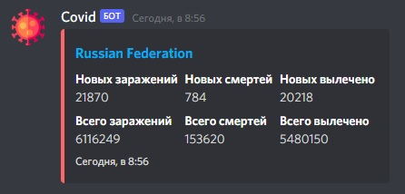

# covid-bot

[](https://xn--80aesfpebagmfblc0a.xn--p1ai/)

[Invite](https://discord.com/oauth2/authorize?client_id=869884634589179935&permissions=0&scope=bot)

## Table of Contents

- [About](#about)
- [Getting Started](#getting_started)
- [Usage](#usage)

## About <a name = "about"></a>

Discord bot that displays covid-19 data.

## Getting Started <a name = "getting_started"></a>

These instructions will get you a copy of the project up and running on your local machine for development and testing purposes. See [deployment](#deployment) for notes on how to deploy the project on a live system.

### Prerequisites

What things you need to install the software and how to install them.

```
node
```

### Installing

Install dependencies

```
npm i
```

Write settings into .env

[.env.example](.env.example) as example

Start bot

```
npm run start
```

## Usage <a name = "usage"></a>

Write *covid (country name / nothing for world)

### Demo

[](https://discord.com/oauth2/authorize?client_id=869884634589179935&permissions=0&scope=bot)